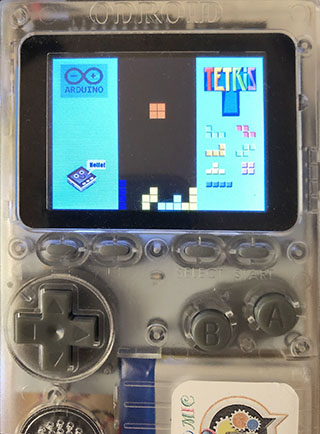

# Tetris for Odroid-GO (& M5Stack)

### Modified by Micutil

- Refered source code: [TETRIS with M5STACK by macsbug](https://macsbug.wordpress.com/2018/01/20/tetris-with-m5stack/)
- Refered source code: [esp32\_ILI9328\_Tetris by MhageGH](https://github.com/MhageGH/esp32_ILI9328_Tetris)
- Modified the sketch for Odroid-GO ([using ESP32-Chimera-Core](https://github.com/tobozo/ESP32-Chimera-Core)).

### Binary files for Launcher
- in M5_Gamebin ... 4M minimal SPIFFS partition scheme.
- in MD_Gamebin ... 4M default partition scheme.
- in MF_Gamebin ... Fire defaut partition scheme.
- in OG_Gamebin ... bin file for Odroid-GO.
- in odroid/firmwares ... fw file for Odroid-GO Menu Control.

### Copy the binary files to microSD

- Copy the files in the microSD folder to the root of microSD.
- Set the microSD into the M5Stack / Odroid-GO
- Select and launche the program with [LovyanLauncher](https://github.com/lovyan03/M5Stack_LovyanLauncher).
- For the original Odroid-GO device firmware menu control, no launcher is needed (see below).

##### ODROID-GO Device Firmware Menu Controls

	1. Power Switch Off
	2. Hold B button, Power Switch On
	3. Release B button when device firmware Menu appears.

	Launch an app
	- A button: Select Application F/W
	- B button: Cancel
	- Start : Write Application F/W

### How to play for Odroid-GO version

- A button: start game.
- A/B button: rotate lockwisec or counterclockwise.
- Left/right key: move block to left or right.

